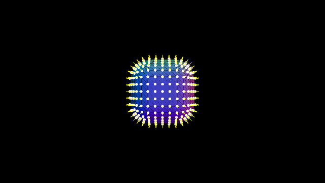
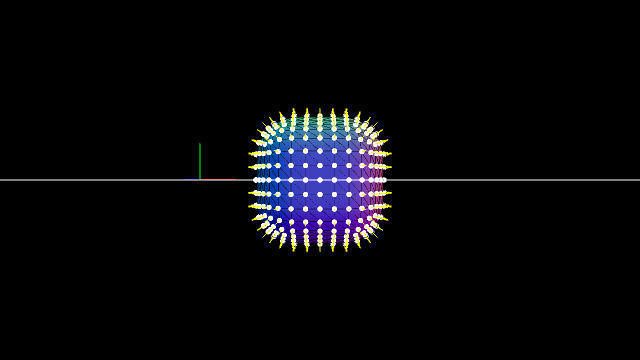

GitHub: [https://github.com/kenjiSpecial/tubugl-camera](https://github.com/kenjiSpecial/tubugl-camera)

### [#00 - perspective camera](./app00/index.html)

[codes](https://github.com/kenjiSpecial/tubugl-camera/blob/master/examples/app00) | [source for perspective camera](https://github.com/kenjiSpecial/tubugl-camera/blob/master/src/perspectiveCamera.js)

### [#01 - camera controller](./app01/index.html)

[codes](https://github.com/kenjiSpecial/tubugl-camera/tree/master/examples/app01) | [sorce for camera controller](https://github.com/kenjiSpecial/tubugl-camera/blob/master/src/cameraController.js)

### [#02 - perspective/orthographic camera](./app02/index.html)

[codes](https://github.com/kenjiSpecial/tubugl-camera/tree/master/examples/app02) | [source for perspective camera](https://github.com/kenjiSpecial/tubugl-camera/blob/master/src/perspectiveCamera.js) | [source for orthographic camera](https://github.com/kenjiSpecial/tubugl-camera/blob/master/src/orthographicCamera.js)

all examples were made with [tubugl](https://github.com/kenjiSpecial/tubugl)
